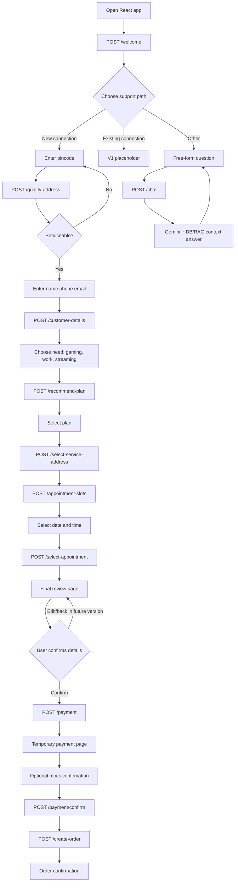

# Signal Selector — High-Level Design

## 1. Objective

Signal Selector is a V1 telecom customer-support and new-connection assistant. It supports a guided new-connection journey and a free-form “Other” chatbot for questions about plans, cities, pricing, speeds, and serviceability.

V1 intentionally uses an in-memory session store, mock payment behavior, PostgreSQL, and a React single-page frontend. Authentication, production payment processing, Redis, background jobs, and operational hardening are out of scope.

## 2. Architecture

```text
React/Vite browser
      |
      | REST/JSON + CORS
      v
FastAPI application
  |       |        |
 API     Services  Chat/LangGraph
  |       |        |
  +-------+--------+---- SessionStore (in-memory V1)
          |
          +---- SQLAlchemy ORM ---- PostgreSQL
          |       addresses, plans, customers,
          |       appointment_slots, orders
          |
          +---- RAG retriever ---- ChromaDB (opt-in)
          |
          +---- Gemini adapter ---- Google AI Studio API (optional)
```

## 3. Frontend

The frontend is a React/Vite single-page application in `frontend/`.

- `App.jsx` owns the guided conversation state and calls backend endpoints.
- `styles.css` and `flow.css` provide the responsive visual system.
- The chat card has a fixed viewport; `.messages` is the only scrolling region.
- The UI steps are: choice → pincode → details → need → plans → appointment → review → payment.
- The “Other” option renders a free-form chat composer and calls `POST /chat`.
- RAG mode answers directly from live catalog data; AI mode asks Gemini to interpret the question using retrieved Qcom context.
- `VITE_API_URL` can override the default API URL.

## 4. FastAPI backend

`app/main.py` creates the FastAPI application, configures local CORS, and registers routers. Route files are thin and delegate business work to services.

### API map

| Endpoint | Responsibility |
|---|---|
| `POST /welcome` | Create or reuse a session and return greeting |
| `POST /qualify-address` | Check pincode serviceability and network context |
| `POST /recommend-plan` | Retrieve and rank plans based on need and address speed |
| `POST /customer-details` | Fetch or store customer information in session |
| `POST /select-service-address` | Select a valid address for the chosen plan |
| `POST /appointment-slots` | Return available slots for the address FDH |
| `POST /select-appointment` | Reserve a selected installation slot |
| `POST /payment` | Generate a mock payment URL/status |
| `POST /payment/confirm` | Mark mock payment complete |
| `POST /create-order` | Persist the finalized order |
| `POST /chat` | Answer free-form Qcom questions with Gemini/context fallback |
| `GET /health` | Runtime health check |

## 5. Data layer

SQLAlchemy models are one table per file:

- `addresses`: pincode, location, FDH/MST/OLT, serviceability, maximum speed.
- `plans`: plan identity, speed, price, technology, minimum speed.
- `customers`: customer contact details and existing pincode.
- `appointment_slots`: date, time window, FDH, availability.
- `orders`: selected plan, customer, address, payment status, appointment, and session snapshot.

`data/generate_dataset.py` creates synthetic CSV files. `data/seed.py --reset` recreates the five Qcom demo tables and loads the generated data.

## 6. RAG and Gemini

### Guided plan recommendations

1. The address qualification response supplies `max_speed_available_mbps`.
2. `plan_service.py` filters plans above that speed.
3. `rag/retriever.py` ranks relevant plans using ChromaDB when `CHROMA_ENABLED=true`.
4. With Chroma disabled, deterministic ranking is used so local setup does not wait for an embedding model download.
5. Gemini optionally produces concise plan reasoning when `GEMINI_API_KEY` is configured.

### Free-form chatbot

`POST /chat` gathers plan and city context from PostgreSQL. In RAG mode, cheapest and fastest questions are calculated directly from catalog fields. In AI mode, relevant plans are retrieved and sent to Gemini with a constrained prompt that requires exact prices and prohibits invented service guarantees. If the key is missing or Gemini times out, the API returns the deterministic RAG answer.

The Gemini request has a timeout so a slow provider cannot block the chatbot indefinitely.

## 7. LangGraph and sessions

`app/chat/graph.py` defines the V1 conversation state and stage transitions. The active web flow is controlled by React because each form step requires user input; LangGraph provides the backend orchestration contract for future conversational automation.

`app/chat/session.py` exposes `SessionStore` with `create`, `get`, and `update`. It is currently an in-memory dictionary keyed by `session_id`. The interface is intentionally small so it can later be backed by Redis without changing route contracts.

## 8. End-to-end new-connection flow



## 9. Deployment shape

For local V1:

```text
PostgreSQL :5432
FastAPI/Uvicorn :8000
React/Vite :5173
ChromaDB ./chroma_data, only when enabled
```

For a future deployment, place React behind a CDN/static host, FastAPI behind a reverse proxy, PostgreSQL as a managed database, Redis as the session store, ChromaDB as a persistent vector service, and Gemini behind a server-side secrets-managed adapter.

## 10. V1 limitations and next steps

- No authentication or authorization.
- Sessions disappear when the API process restarts.
- Payment is mocked.
- Appointment reservation is basic and should gain expiry/transaction handling.
- Gemini prompt/history management should become a dedicated conversation service.
- Add automated frontend tests, API contract tests, structured logging, rate limits, and monitoring before production use.
